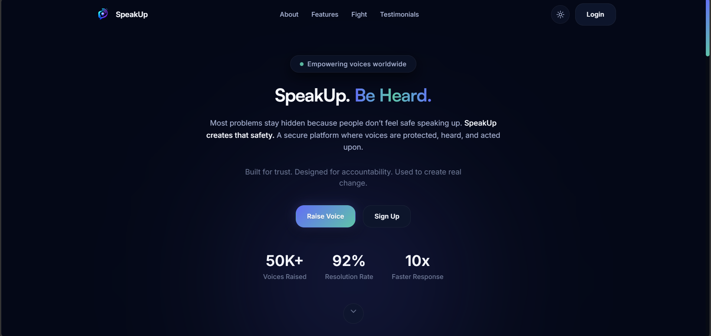
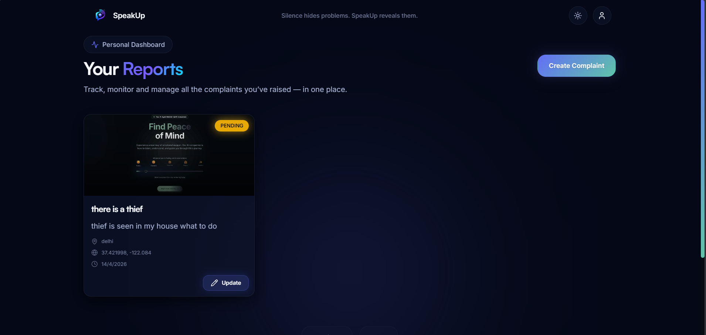
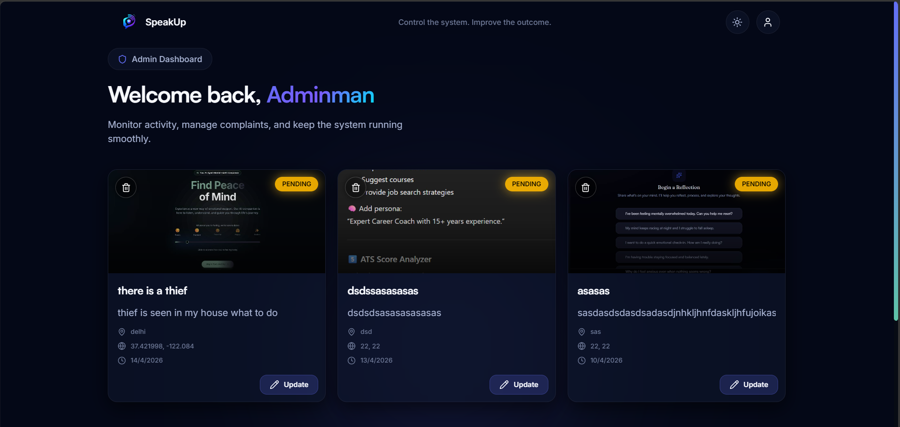

# 🚨 SpeakUp

> A powerful, modern crime reporting platform where voices are heard, identities are protected, and action is taken.

---

## 🌍 Introduction

**SpeakUp** is a full-stack web application designed to empower individuals to report crimes, incidents, or public issues safely and efficiently. Whether users choose to stay anonymous or authenticated, the platform ensures their voice reaches the right authority.

The system also provides a robust **admin dashboard** for monitoring, verifying, and managing complaints in real-time.

---

## 🎯 Vision

To create a **safe, transparent, and accessible platform** where anyone can report issues without fear — and ensure those reports lead to meaningful action.

---

## ✨ Core Features

### 👤 User Features

* 📝 Create complaints (Emergency / Non-Emergency)
* 🕵️ Anonymous reporting without login
* 📍 Add location, latitude & longitude
* 🖼 Upload multiple images as evidence
* 📊 Track complaint status:

  * Pending
  * In Progress
  * Resolved
  * Dismissed
* ✏️ Update complaints
* ❌ Delete own complaints
* ⚡ Smooth animated dashboard (GSAP powered)
* 🎨 Modern UI with dark theme and glass effects

---

### 🛡️ Admin Features

* 📂 View ALL complaints across platform
* 🔍 Detailed complaint inspection
* 🔄 Update complaint status in real-time
* ❌ Delete any complaint
* 🧠 Conflict-safe updates (optimistic concurrency)
* ⚡ Fast moderation workflow
* 📊 Organized dashboard with filters and pagination

---

### 🔐 Authentication & Security

* 👥 Separate User & Admin authentication
* 🍪 Secure cookie-based sessions
* 🔑 JWT authentication
* 🛡️ Role-based access control (RBAC)
* ✅ Input validation using Zod
* 🔒 Protected routes (frontend + backend)

---

## 🧱 Project Structure

```
SpeakUp/
│
├── frontend/          # React + TypeScript app
│   ├── components/
│   ├── pages/
│   ├── store/
│   ├── lib/
│
├── backend/           # Node.js + Express API
│   ├── controllers/
│   ├── routes/
│   ├── middlewares/
│   ├── prisma/
│
├── screenshots/       # App screenshots
│   ├── landing.png
│   ├── user-dashboard.png
│   ├── admin-dashboard.png
│
└── README.md
```

---

## 🖼️ Screenshots

### 🌐 Landing Page



### 👤 User Dashboard



### 🛡️ Admin Dashboard



---

## 🧰 Tech Stack

### Frontend

* ⚛️ React (TypeScript)
* 🎨 Tailwind CSS + Custom Design System
* 🎬 GSAP (Animations)
* 🧠 Zustand (State Management)
* 🔔 Sonner (Toast Notifications)
* 🧩 Lucide Icons

### Backend

* 🟢 Node.js + Express
* 🧠 Prisma ORM
* 🐘 PostgreSQL
* 🔐 JWT Authentication
* 🧾 Zod Validation

---

## ⚙️ Installation Guide

### 1. Clone the Repository

```bash
git clone https://github.com/krishnasahu22032003/speakup.git
cd speakup
```

---

### 2. Setup Backend

```bash
cd backend
npm install
```

Create `.env` file:

```
DATABASE_URL=your_database_url
JWT_SECRET=your_secret
```

Run backend:

```bash
npm run dev
```

---

### 3. Setup Frontend

```bash
cd ../frontend
npm install
npm run dev
```

---

## 🔁 Workflow

### User Flow

1. User visits landing page
2. Reports complaint (anonymous or logged-in)
3. Complaint stored in database
4. User tracks status in dashboard

### Admin Flow

1. Admin logs in
2. Views all complaints
3. Updates status or deletes complaint
4. Changes reflect instantly

---

## 🧠 Advanced Concepts Used

* Optimistic Concurrency Control (using `updatedAt`)
* Role-Based Access Control (RBAC)
* Modular API architecture
* Reusable UI components
* Smooth animations with GSAP

---

## 🚀 Future Improvements

* 🌍 Map integration (Google Maps / Leaflet)
* 🔔 Real-time notifications (WebSockets)
* 📊 Advanced analytics dashboard
* 📱 Mobile responsiveness enhancements
* 🌐 Multi-language support

---

## 🤝 Contributing

Contributions are welcome!

```bash
1. Fork the repository
2. Create a new branch
3. Commit your changes
4. Push and create a PR
```

---

## 📧 Contact

For queries, feedback, or collaboration:

📩 Email:krishna.sahu.work@gmail.com

---

## ❤️ Made with Love By krishna 

Crafted with passion to empower voices, ensure safety, and build a better society.

---

## ⭐ Support

If you like this project:

⭐ Star the repository
📢 Share with others
💡 Contribute ideas

---
